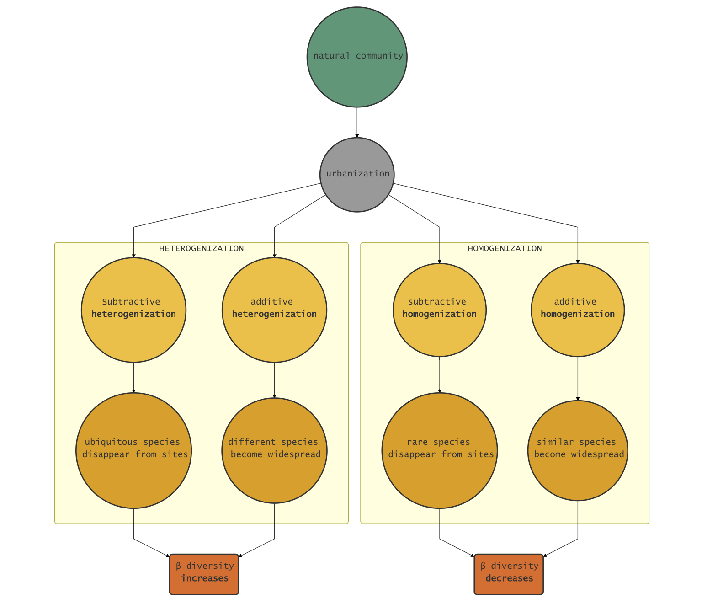

```{r setup, include=FALSE}
knitr::opts_chunk$set(echo = TRUE)
```

### Path diagram of research ideas
This path diagram illustrates how beta-diversity can change as the result of local species gains (additive processes) or local species losses (subtractive processes).

These losses or gains can be influenced by land use change, such as urbanization. Land use driven beta-diversity change can result in the homogenization or heteogenization of natural communities  


  

